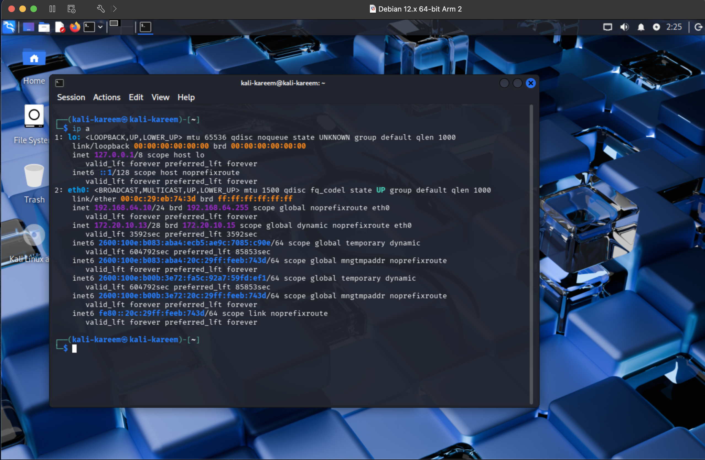
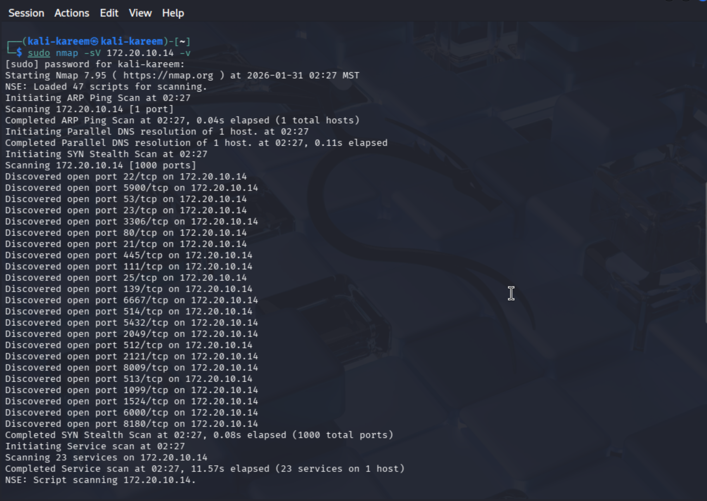

Overview

The goal of this assignment was to build a local penetration testing lab
environment using Kali Linux and Metasploitable2. This lab will be used
throughout the course to practice vulnerability scanning and
exploitation using tools such as Nmap and the Metasploit Framework.

The environment consists of two main virtual machines:

- Kali Linux, which acts as the attacker machine.

- Metasploitable2, which is a deliberately vulnerable target system.

Both machines were configured to run on the same virtual network so that
Kali can discover and attack Metasploitable.

**Part 0 – Installing Required Software**

Before setting up the lab, I installed the required software on my
system:

- Virtualization platform (VMware Fusion / UTM depending on host)

- Kali Linux virtual machine

- Metasploitable2 virtual machine

Even though the lab instructions reference VirtualBox and Vagrant, I
used VMware Fusion and UTM due to running on Apple Silicon (ARM). The
end result is functionally the same: two VMs on the same internal
network.

Screenshot 1 – Kali Linux VM Running

This screenshot shows Kali Linux successfully booted and running inside
the virtual machine. This confirms that the attacker environment is
operational and ready to be used for penetration testing.

**Part 1 – Kali Linux Network Configuration**

Once Kali was running, I verified that it had a valid IP address on the
internal network using the command:

ip a

This allowed me to confirm that Kali was properly connected to the
virtual network and could communicate with other machines.

Screenshot 2 – Kali IP Configuration

This
screenshot shows the output of the ip a command on Kali. The important
part is the eth0 interface, which displays the IPv4 address assigned to
Kali. This IP will later be used to communicate with Metasploitable.

**Part 2 – Installing Metasploitable2**

Metasploitable2 was downloaded as a prebuilt vulnerable virtual machine
image and imported into the virtualization platform. No operating system
installation was required since the image already contains Ubuntu and
all vulnerable services.

After importing, I powered on the Metasploitable VM and logged in using
the default credentials:

Username: msfadmin  
Password: msfadmin

Screenshot 3 – Metasploitable Login

This screenshot shows that I successfully logged into the Metasploitable
system. This confirms that the vulnerable target machine is running
correctly.

**Part 3 – Verifying Network Connectivity**

To ensure both machines were on the same network, I checked the IP
address of Metasploitable using:

ifconfig

Then, from Kali, I tested connectivity by pinging the Metasploitable IP.

Screenshot 4 – Metasploitable IP Address

This
screenshot shows the network configuration of Metasploitable, including
its IP address on the internal network.

Screenshot 5 – Kali Pinging Metasploitable

This
screenshot shows Kali successfully pinging Metasploitable. This confirms
that both machines can communicate and that the lab network is set up
correctly.

**Part 4 – Scanning the Target with Nmap**

After verifying connectivity, I used Nmap from Kali to scan the
Metasploitable machine:

sudo nmap -sV 10.0.0.223 -v

This command performs a service version scan and identifies open ports
and running services.

Screenshot 6 – Nmap Scan Results

This screenshot shows the results of the Nmap scan. The output reveals
multiple open ports such as:

- 21 (FTP)

- 22 (SSH)

- 23 (Telnet)

- 80 (HTTP)

- 3306 (MySQL)

- 5900 (VNC)

These open services confirm that Metasploitable is intentionally
insecure and suitable for exploitation labs.

**Part 5 – Vulnerable Web Application (Vibe-Coded App)**

In addition to the standard lab, I also created a custom vulnerable web
application using an AI-assisted development approach (“vibe coding”).
The goal of this app was to simulate a real-world insecure system that
could later be used for vulnerability testing.

The application is a simple product rental platform (Brisk) that
includes:

- User authentication (login/register)

- Product listings

- Filtering functionality

This app was intentionally built without proper security controls and
will later be used for testing vulnerabilities such as:

- Input validation issues

- Authentication flaws

- Potential injection points

Screenshot 7 – Vulnerable Web App Interface

This screenshot shows the front-end of the vulnerable application. It
demonstrates that the app is functional and provides a realistic target
for future penetration testing exercises.

**Conclusion**

By completing this assignment, I successfully built a full penetration
testing lab consisting of:

- Kali Linux as the attacker machine

- Metasploitable2 as the vulnerable target

- A custom vulnerable web application for extended practice

All machines are on the same virtual network, Kali can successfully
communicate with Metasploitable, and Nmap confirms the presence of
multiple exploitable services. This environment is now ready to be used
for future labs involving vulnerability scanning and exploitation with
Metasploit.
