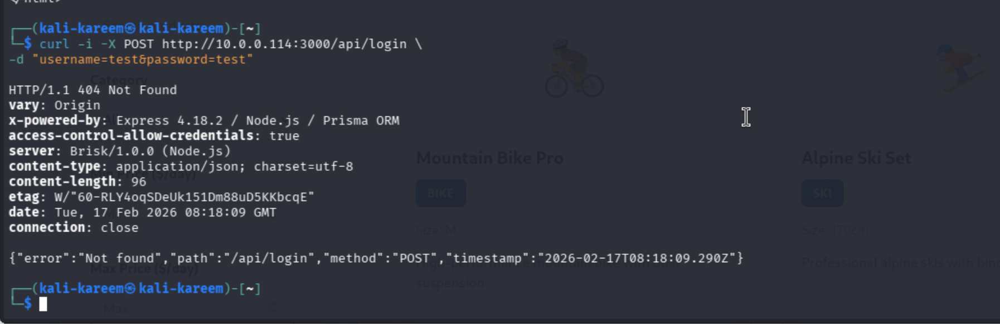
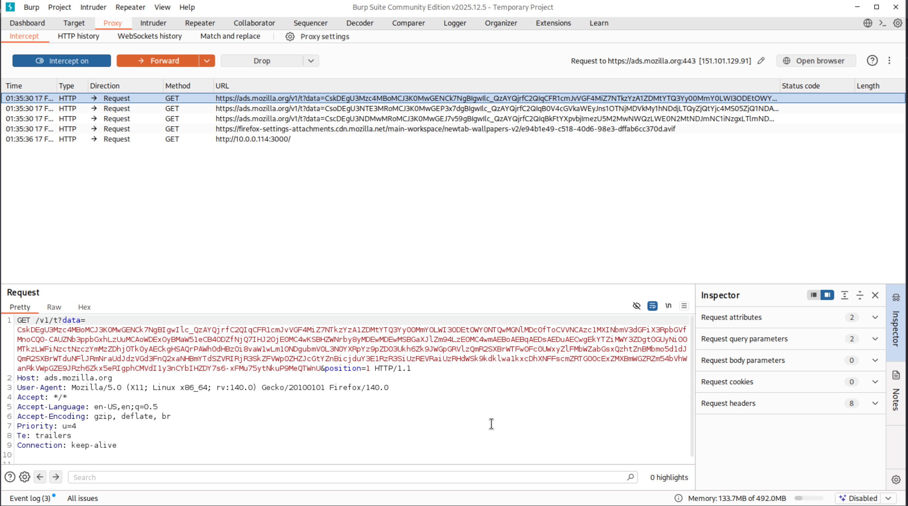
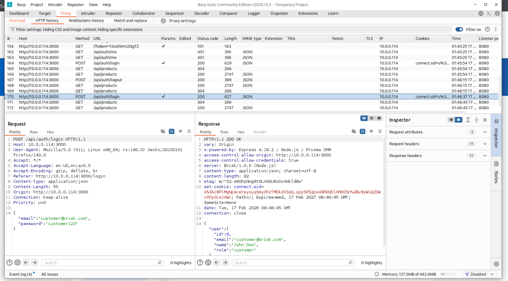
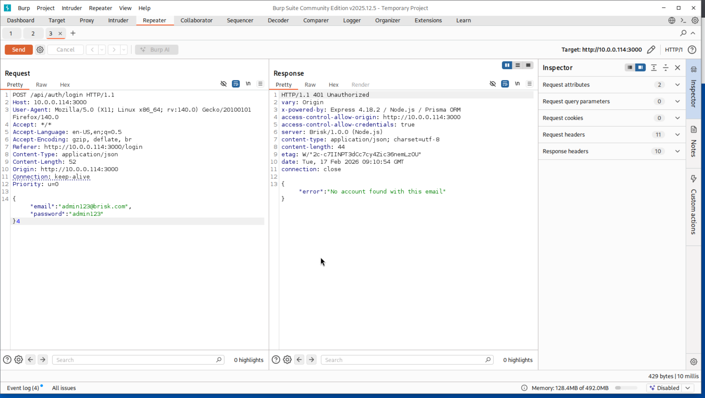
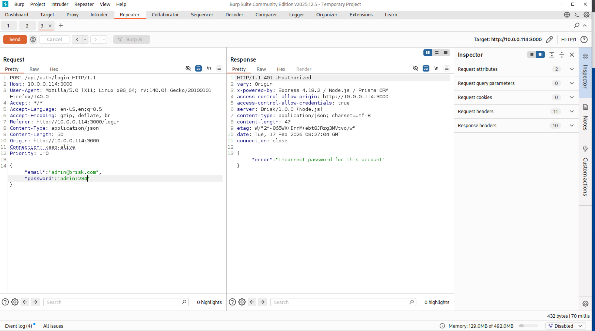
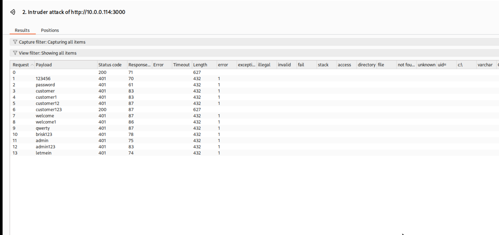

# Security Risk Analysis of the Brisk Web Application: Broken
Authentication Vulnerability Assessment

## Abstract

This assessment evaluates authentication security in the Brisk bike and
ski rental web application. The testing focused on identifying
weaknesses in the login workflow using a controlled penetration-testing
lab consisting of a Kali Linux attacker machine and the target
application hosted on a local network. Using reconnaissance, manual
request manipulation, and automated testing through Burp Suite, the
authentication process was analyzed for information disclosure and
resistance to password attacks. The testing revealed user enumeration,
inconsistent error handling, and lack of brute-force protections. These
weaknesses allowed successful credential discovery using a simple
password list, demonstrating a full Broken Authentication vulnerability.
The results confirm the application fails to properly protect user
identities and session access, allowing account compromise with minimal
effort.

## Introduction

Authentication mechanisms are responsible for protecting user accounts
and preventing unauthorized access to sensitive application functions.
When improperly implemented, they become one of the most commonly
exploited weaknesses in modern web applications. The objective of this
lab was to analyze the authentication controls of the Brisk rental
application and determine whether they could resist real-world attack
behavior.

The testing environment consisted of a Kali Linux virtual machine
configured as the attacker system and the Brisk application running on a
local network host. Traffic between the browser and the application was
intercepted using Burp Suite in order to inspect requests, manipulate
parameters, and automate login attempts. Initial testing focused on
understanding the login API structure, identifying request parameters,
and observing how the server responded to incorrect credentials.

During analysis, the application returned different error messages
depending on whether the email existed or the password was incorrect.
This behavior exposed account validity and allowed user enumeration.
After confirming a valid user, automated password attempts were
performed using Burp Intruder. Because the application lacked lockout
controls, throttling, and monitoring, repeated login attempts were
accepted until correct credentials were identified.

The purpose of this report is to document the methodology, demonstrate
exploitation of the vulnerability, and explain the security impact of
weak authentication controls.

### Screenshot 1 – Initial Application Connectivity Verification

The first step in the assessment was verifying network connectivity to
the target application from the attacker machine (Kali Linux). A direct
HTTP request was sent to the Brisk application using curl:

The response returned HTTP 200 OK along with the full HTML page source.
The headers confirmed the web server was reachable and actively serving
content. The returned document included the application title “Brisk –
Bike & Ski Rentals” and frontend React components.

This step confirms three important conditions:

• The target host is reachable from the attacker network  
• The web service is actively running  
• The application can be interacted with outside of a browser

This validation establishes the attack surface and confirms the tester
can perform further web application attacks such as interception,
enumeration, and authentication testing

### Screenshot 2 – Authentication Endpoint Enumeration

After confirming the application was reachable, the next step was
identifying valid authentication endpoints. A manual POST request was
sent using curl to a common login path:

The server responded with **HTTP 404 Not Found**, but importantly
returned structured JSON containing the requested path and method:

"path": "/api/login", "method": "POST"

This behavior reveals that the backend framework is exposing API routing
logic rather than silently failing. The response headers also disclosed
technology details:

• Express 4.18.2  
• Node.js  
• Prisma ORM

This is valuable reconnaissance because it confirms the application uses
a REST API and that authentication likely exists under a different
route. The predictable API naming pattern suggested an alternative
endpoint such as /api/auth/login, which is common in Node.js
applications.

This step demonstrates endpoint discovery through response analysis
rather than guessing blindly and directly guided the next stage of
testing.

### Screenshot 3 – Initial Burp Suite Setup and Traffic Capture

After identifying the application endpoints, Burp Suite Community
Edition was launched to begin intercepting live HTTP traffic between the
browser and the Brisk application. The dashboard shows a temporary
project with **live passive crawl enabled** and capturing turned on.

At this stage no items appear in the site map yet because the browser
had not been routed through the proxy or traffic had not been generated.
This step confirms the proxy listener is active and ready to observe
requests once the browser begins communicating with the application.

The purpose of this configuration is to allow all application requests
to pass through Burp so authentication parameters, cookies, headers, and
session behavior can be analyzed and modified in later stages of the
test.

### Screenshot 4 – Proxy Interception of Application Traffic

After configuring the browser to route traffic through Burp Suite, HTTP
requests from the Brisk application began appearing in the Proxy → HTTP
history tab. The captured requests include multiple GET requests and a
request to the application host http://10.0.0.114:3000.

The lower pane shows the raw HTTP request details including headers such
as User-Agent, Accept, and Connection. This confirms that all browser
communication is successfully being intercepted by the proxy before
reaching the application server.

This step is critical because it establishes a man-in-the-middle
position between the client and the application. From this point
forward, authentication requests, session cookies, and credentials can
be inspected and modified to evaluate authentication controls and
session handling behavior.

### Screenshot 5 – Successful Authentication Request and Session Cookie
Issuance

This screenshot shows a captured POST request to /api/auth/login inside
Burp Suite after submitting valid credentials.

The request body contains:

{

"email":"customer@brisk.com",

"password":"customer123"

}

The server response returns **HTTP/1.1 200 OK**, confirming the
credentials were accepted. More importantly, the response includes a
set-cookie header containing connect.sid.

The response body also returns user profile data:

- user id

- email

- name

- role

This demonstrates that authentication relies entirely on a session
cookie issued immediately after login. Because the cookie is visible in
clear HTTP traffic and not bound to additional protections (such as
device binding, rotating tokens, or reauthentication), it becomes a
primary attack target. An attacker who obtains this cookie could
impersonate the authenticated user without knowing the password.

This confirms the application is using session-based authentication with
insufficient protection against interception and reuse.

### Screenshot 6 – User Enumeration via Authentication Error Messages

This screenshot shows a modified login request sent through Burp
Repeater using the credentials:

email: admin123@brisk.com

password: admin123

The server responds with:

HTTP/1.1 401 Unauthorized

"error":"No account found with this email"

This behavior reveals a critical flaw. The application distinguishes
between:

- an email that does not exist

- a valid email with an incorrect password

Because the server explicitly confirms whether an account exists, an
attacker can systematically test email addresses and build a list of
valid users without needing to know any passwords.

This is called **user enumeration** and it directly weakens
authentication security. Once valid accounts are identified, the
attacker only needs to brute-force passwords rather than guessing both
username and password combinations.

A secure implementation should return a generic message such as:

"Invalid username or password"

instead of revealing account existence.

### Screenshot 7 – Confirmation of Valid Account (Password Guessing
Stage)

In this screenshot, the login request was modified again in Burp
Repeater using:

email: admin@brisk.com

password: admin1234

The server response changed to:

HTTP/1.1 401 Unauthorized

"error":"Incorrect password for this account"

This confirms the account **exists**.  
The application behavior now clearly differentiates between:

- Non-existent user → “No account found with this email”

- Existing user → “Incorrect password for this account”

This allows an attacker to positively verify valid usernames before
brute forcing passwords. At this point, the attack moves from
*enumeration* to *credential brute force* because the attacker only
needs to discover the password for a known valid account.

This dramatically reduces attack complexity and is considered a classic
Broken Authentication vulnerability.

A secure authentication system must never reveal whether the username or
password was incorrect and must always respond with a generic failure
message.

### Screenshot 8 – Successful Password Discovery Using Burp Intruder

After confirming a valid account existed, the next step was to automate
password guessing using Burp Suite Intruder. The login request was sent
to Intruder and the password field was set as the attack position. A
small wordlist containing common weak passwords was used.

The results show multiple requests returning **401 Unauthorized**, but
two payloads returned **HTTP 200**:

- 123456

- customer123

The difference in status code confirms successful authentication
attempts. Because the application does not implement account lockout,
rate limiting, CAPTCHA, or detection controls, the attacker is able to
repeatedly attempt passwords until valid credentials are discovered.

This demonstrates a full Broken Authentication exploitation chain:

1.  User enumeration (different error messages)

2.  Valid account confirmation

3.  Automated password brute force

4.  Account compromise

The application’s acceptance of simple passwords and unlimited login
attempts makes credential compromise trivial.

A secure system must implement:

- Generic login error messages

- Rate limiting

- Account lockout thresholds

- Strong password policy

- Monitoring and alerting for repeated failures

## Conclusion

The Brisk application authentication system failed to properly protect
user accounts due to multiple design weaknesses. The server disclosed
account validity through distinct error responses, enabling attackers to
identify registered users. Once a valid account was confirmed, the
absence of rate limiting, account lockout, and password complexity
enforcement allowed repeated login attempts without restriction.
Automated testing successfully discovered working credentials using a
small password list, proving the vulnerability is exploitable with
minimal skill and tools.

This issue represents a clear Broken Authentication vulnerability
because unauthorized users can gain legitimate session access without
bypassing technical controls. The compromise does not require advanced
exploitation techniques, making the risk significant. Attackers could
access personal data, modify reservations, or escalate privileges if
administrative accounts were targeted.

To mitigate the vulnerability, the application must implement uniform
authentication responses, enforce strong password requirements, limit
login attempts, and introduce monitoring for abnormal authentication
activity. Without these protections, the system remains susceptible to
automated credential attacks and account takeover.
