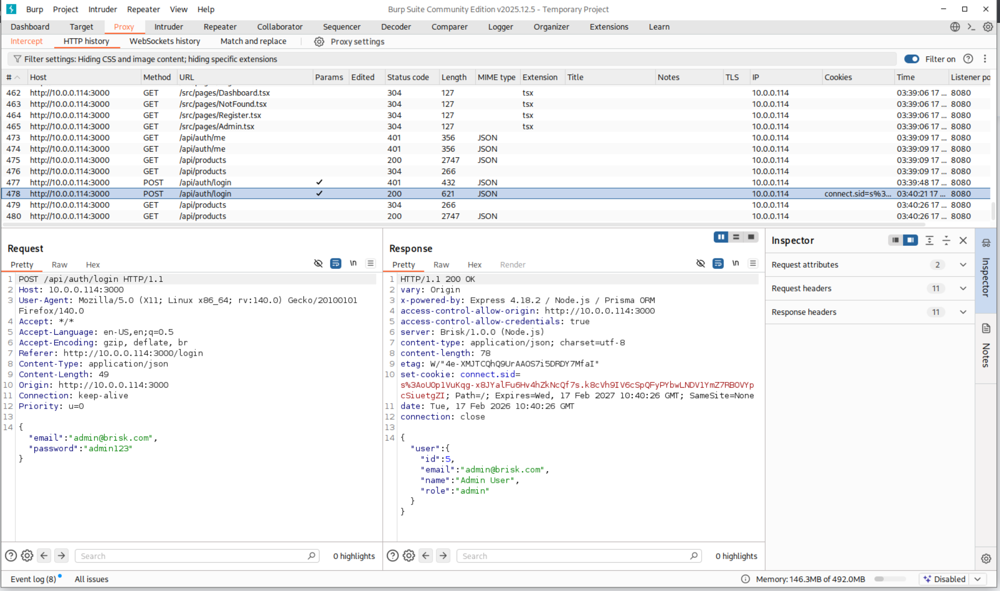
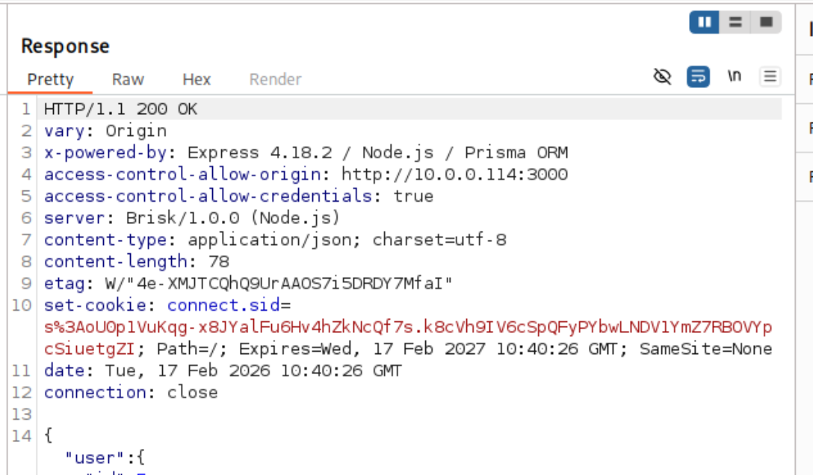
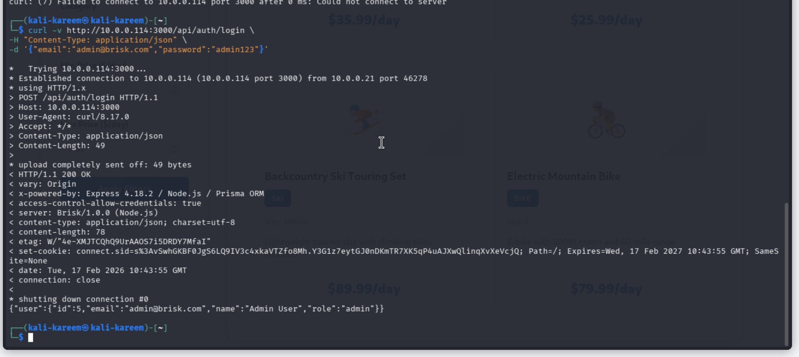

# Security Risk Analysis Assignment – Cryptographic Failures in the Brisk Web Application

## Abstract

This assessment evaluates cryptographic protections implemented within
the Brisk web application by analyzing how authentication data and
session tokens are transmitted between the client and server. Using Kali
Linux, Burp Suite, and direct HTTP requests, the application traffic was
intercepted and examined during normal login activity. The analysis
revealed that the application communicates entirely over HTTP rather
than HTTPS, allowing sensitive authentication information and session
identifiers to be transmitted in cleartext. Because encryption is not
enforced, an attacker positioned on the same network can capture
credentials and reuse session tokens to impersonate legitimate users,
including administrative accounts. The findings demonstrate that the
absence of transport-layer cryptography results in immediate account
compromise without requiring password cracking or exploitation of
application logic. This vulnerability falls under the Cryptographic
Failures category and represents a critical risk to confidentiality and
access control.

## Introduction

Modern web applications rely on cryptographic protections to secure user
authentication, maintain session integrity, and prevent unauthorized
access. The most fundamental protection is transport encryption using
HTTPS, which ensures that sensitive data such as usernames, passwords,
and session cookies cannot be read or modified in transit. When
encryption is missing or improperly configured, the security of the
entire authentication system collapses regardless of password complexity
or backend validation.

During this analysis, the Brisk application was tested from a Kali Linux
attacker machine communicating with the application server over a local
network. Traffic interception was performed using Burp Suite and manual
HTTP requests to observe how authentication data was transmitted. The
login process, session creation, and subsequent authenticated requests
were examined for confidentiality and integrity protections.

Testing confirmed that all authentication communication occurs over
unencrypted HTTP. Login credentials were observable in plaintext, and
the server returned a valid session identifier that could be reused to
impersonate the user. The issue was reproducible both through the
browser and through direct API requests, proving that the vulnerability
exists at the protocol level rather than the interface level. This
behavior demonstrates a complete failure of transport-layer cryptography
and directly exposes authentication secrets to interception.

The screenshots above show a successful authentication request
intercepted in Burp Suite where the application responds with HTTP/1.1
200 OK and returns a session cookie labeled connect.sid. The cookie is
delivered in the response header using the Set-Cookie directive and
contains the authenticated user context (admin account). Because the
application is operating over plain HTTP instead of HTTPS, the session
identifier is transmitted in clear text across the network.

This behavior represents a cryptographic failure because the
confidentiality of authentication material depends entirely on transport
encryption. Without TLS, any system on the same network segment can
capture the cookie through passive sniffing tools such as Wireshark or
tcpdump. Once obtained, an attacker can replay the cookie in their own
browser or proxy and immediately impersonate the authenticated user
without knowing the password. This is a classic session hijacking
scenario.

The risk is amplified by multiple additional observations in the
response header. The cookie lacks the Secure flag, meaning browsers will
send it over non-encrypted connections, and the SameSite=None attribute
allows cross-site transmission. Combined with cleartext transport, the
session token becomes fully portable and reusable by an attacker.

Impact:  
An attacker connected to the same network can capture the session token
and gain administrative access to the application, bypassing
authentication entirely.

Root Cause:  
The application relies on HTTP rather than HTTPS and issues
authentication session cookies without enforcing encrypted transport or
secure cookie attributes.

Remediation:  
Enforce HTTPS across the entire application, enable HSTS, and configure
session cookies with Secure, HttpOnly, and appropriate SameSite
restrictions. Additionally, regenerate session IDs after login and
implement short session lifetimes.

This screenshot shows a direct authentication request performed using
curl against the /api/auth/login endpoint. The request contains the
username and password in JSON format and is transmitted over plain HTTP.
The server responds with HTTP/1.1 200 OK and returns both authenticated
user data and a connect.sid session cookie in the response headers.

Because the communication occurs over unencrypted HTTP, both the login
credentials and the resulting session identifier travel across the
network in readable form. Any attacker capable of monitoring traffic on
the same network can capture the credentials during transmission or
simply reuse the session cookie to impersonate the user. Unlike the
browser scenario, this confirms the vulnerability is not limited to the
web interface and exists at the API level as well.

This demonstrates a full compromise path:

1.  Intercept login request

2.  Read username and password directly

3.  Capture session token

4.  Replay token to gain authenticated access

The exposure is particularly severe because the response reveals
administrative privileges in the returned JSON object, meaning the
intercepted session provides elevated access immediately.

Impact:  
An attacker can obtain valid login credentials and authenticated session
tokens through passive network monitoring and gain full administrative
access to the application.

Root Cause:  
The API authentication endpoint operates over HTTP without transport
encryption, allowing sensitive authentication material to be transmitted
in plaintext.

Remediation:  
Require HTTPS for all API endpoints, reject non-TLS requests, implement
Secure and HttpOnly cookie flags, and avoid returning sensitive
authentication tokens over unencrypted channels.

## Conclusion

The cryptographic implementation in the Brisk application fails to
protect sensitive authentication data during transmission. Because HTTPS
is not enforced, both credentials and session tokens are exposed to
anyone capable of monitoring network traffic. An attacker does not need
to brute force passwords or exploit application logic; simply observing
a login request provides immediate authenticated access. Furthermore,
the captured session cookie allows persistent impersonation without
knowledge of the password, making privilege escalation trivial when
administrative accounts are used.

This vulnerability represents a critical security failure because
authentication, authorization, and session management all depend on
confidentiality of transmitted data. Without encryption, all other
security controls become ineffective. The risk includes account
takeover, administrative compromise, data exposure, and unauthorized
actions performed under legitimate user identities.

To remediate the issue, the application must enforce HTTPS for all
communication, reject insecure connections, and configure cookies with
Secure and HttpOnly attributes. Transport encryption is a baseline
security requirement, and until implemented, the application cannot be
considered secure regardless of other protections in place.
