# Broken Access Control and Insecure Direct Object Reference Vulnerability Assessment in the Brisk Application

## Abstract

This assessment evaluated access control enforcement in a web application using an intercepting proxy to analyze authentication, authorization, and direct object access behavior. Multiple endpoints were tested by modifying identifiers and reusing authenticated session cookies belonging to a low-privileged user. The application allowed access to administrative data, user records, and sensitive system information without verifying ownership or role privileges. The findings demonstrate insecure direct object references and missing server-side authorization checks. These weaknesses enable privilege escalation, data exposure, and account takeover. The overall result confirms the presence of Broken Access Control vulnerabilities affecting confidentiality and integrity of application data.

## Introduction

Access control ensures users can only perform actions and view resources permitted by their role and ownership. Modern web applications frequently rely on session cookies for authentication, but authorization must still be validated on every request at the server. When authorization checks are missing or incomplete, attackers can manipulate identifiers in HTTP requests to access restricted information or perform administrative actions. This class of vulnerability is categorized as Broken Access Control and is one of the most critical risks in web security.

The application under test was analyzed using manual request interception and replay. After authenticating as a standard customer account, requests were modified to reference other users, administrative resources, and sensitive objects. The goal was to determine whether the server validated user identity and role before returning data or executing actions. Testing focused on enumeration endpoints, direct object references, and privilege escalation attempts.

### Screenshot 1: Session Cookie Issuance and Authentication Flow Analysis

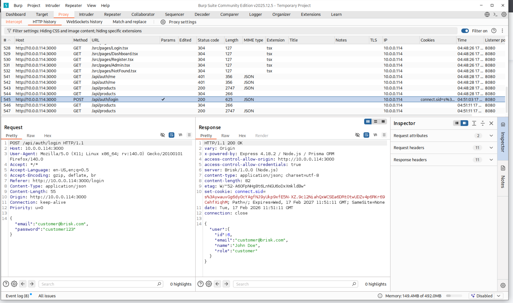

The POST request to /api/auth/login sends user credentials in JSON format. The server returns HTTP 200 OK and includes a Set-Cookie header containing the connect.sid session identifier. The response body confirms successful authentication and returns the user object with role "customer".

This demonstrates the application uses server-side session authentication. After login, the browser automatically attaches the session cookie to subsequent requests, allowing access to protected endpoints without resubmitting credentials. Possession of the session cookie alone is sufficient to authenticate requests.

### Screenshot 2: Direct Access to Client-Side Admin Page Source

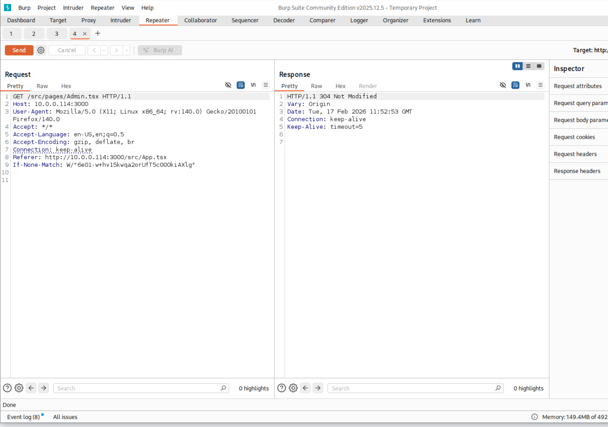

A GET request was manually issued to /src/pages/Admin.tsx through Burp Repeater. The server responded with HTTP 304 Not Modified, indicating the file exists and is retrievable from the web server without authentication enforcement.

This shows the application exposes internal frontend source files directly to users. Even though this is not yet a privilege escalation, it discloses application structure and reveals potential administrative functionality endpoints. Attackers can enumerate hidden routes and identify privileged features that are not meant to be discoverable.

### Screenshot 3: Insecure Direct Object Reference (IDOR) on Product Retrieval

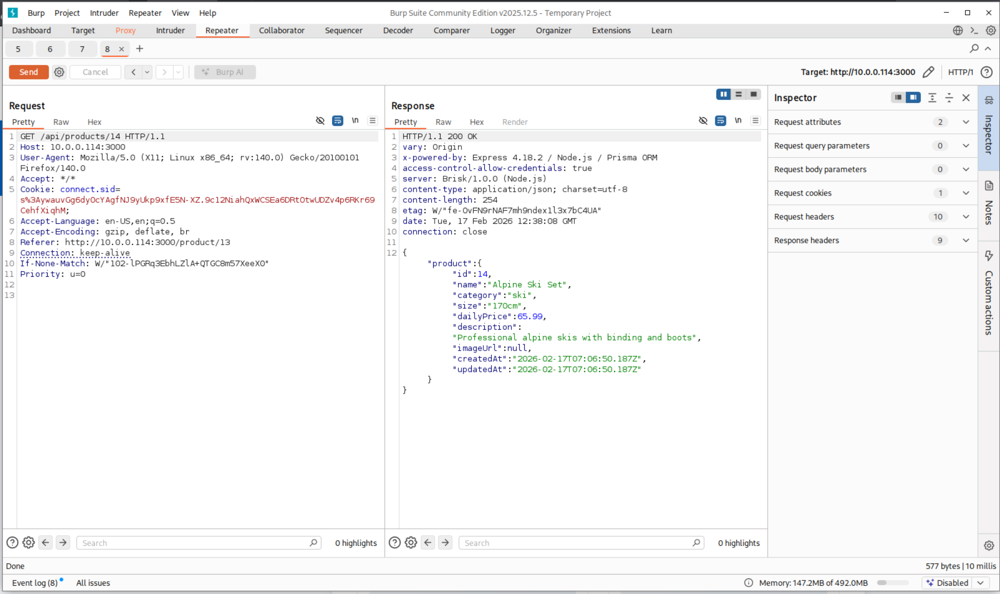

A GET request was sent to /api/products/14 while authenticated as a low-privileged user (customer role). The server returned HTTP 200 OK and disclosed full product details including category, pricing, description, and timestamps.

Because the product identifier can be modified directly in the URL and the server returns the resource without verifying ownership or authorization level, the endpoint is vulnerable to IDOR. An attacker can enumerate product IDs to access data they should not be permitted to query, demonstrating broken access control at the object level.

### Screenshot 4: Privilege Bypass via Unrestricted User Enumeration

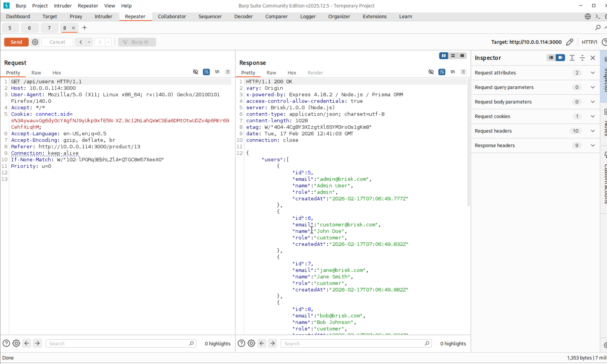

A standard authenticated customer session was used to request GET /api/users. The server responded with HTTP 200 OK and returned a full list of application users, including admin accounts, email addresses, roles, and creation timestamps.

This endpoint should be restricted to administrative roles only. The absence of role validation allows any authenticated user to enumerate all system accounts, resulting in information disclosure and horizontal privilege escalation. This confirms broken access control due to missing authorization checks on a sensitive administrative resource.

### Screenshot 5: Unauthorized Bulk User Enumeration via Authenticated Customer Session

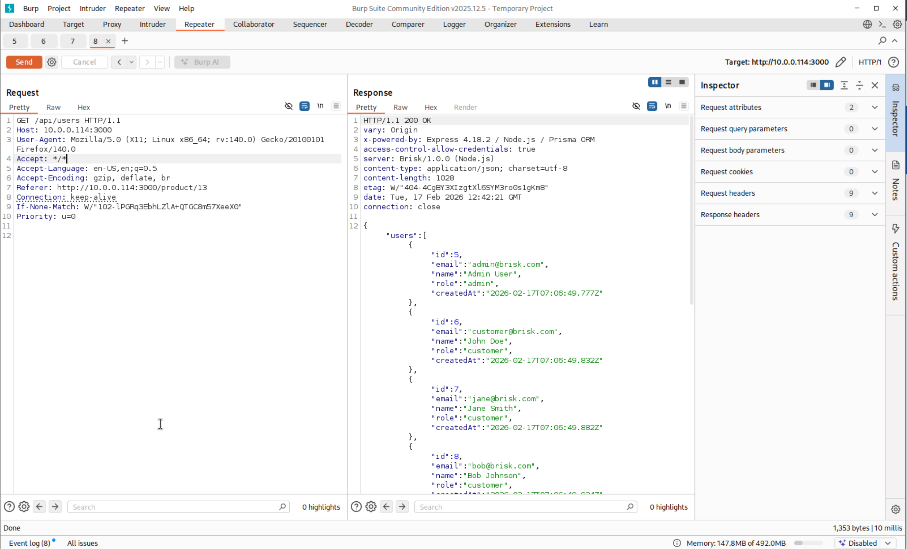

An authenticated customer session successfully accessed GET /api/users and received HTTP 200 OK containing the full user directory, including administrator accounts and role assignments. The endpoint failed to enforce role-based authorization, allowing a low-privileged user to enumerate internal users. This confirms vertical access control failure and increases the risk of targeted attacks such as privilege escalation and credential attacks.

### Screenshot 6: Insecure Direct Object Reference Allowing Access to Other User Records

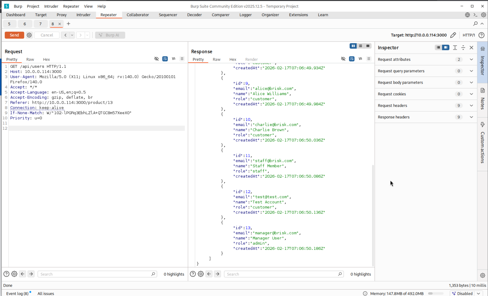

A customer-authenticated session requested GET /api/users/6 and received HTTP 200 OK with another user's full profile data, including reservations and reviews. The application relied only on authentication and failed to verify object ownership. This demonstrates an IDOR vulnerability where sequential identifiers allow horizontal privilege escalation and exposure of sensitive user information.

### Screenshot 7: Privilege Escalation via IDOR Exposing Administrator Secrets

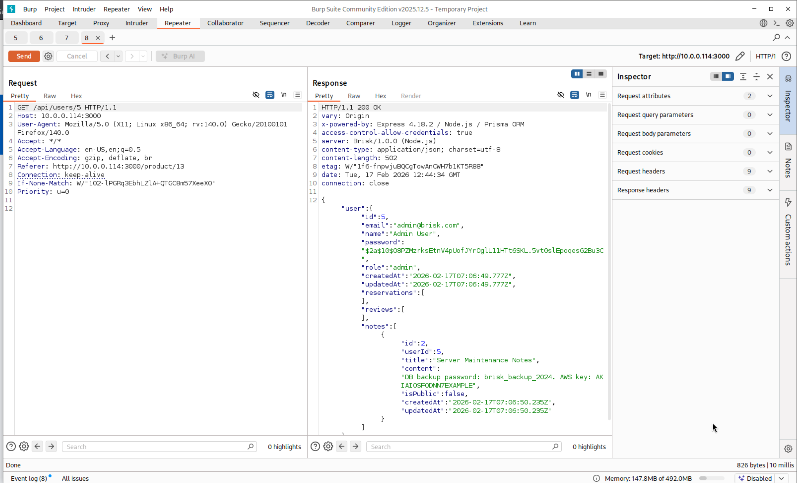

Using the same authenticated customer session, the request GET /api/users/5 returned HTTP 200 OK and disclosed the administrator account. The response exposed sensitive internal data including hashed password values and operational notes containing backup credentials and cloud keys. The application failed to enforce role-based authorization checks, allowing horizontal access to privileged accounts and resulting in critical information disclosure.

### Screenshot 8: Horizontal Account Data Exposure Through User Enumeration

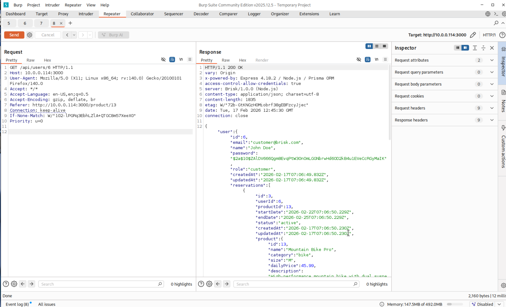

A request to GET /api/users/6 using the same authenticated session returned HTTP 200 OK and exposed another user's full profile information. The response contained personal details, hashed credentials, reservation records, and associated product activity. Because the endpoint relied only on authentication and did not verify ownership of the requested resource, any user ID could be enumerated to harvest other customers' private data. This confirms an insecure direct object reference vulnerability enabling unauthorized data access across accounts.

### Screenshot 9: Cross-Account Reservation and Activity Disclosure

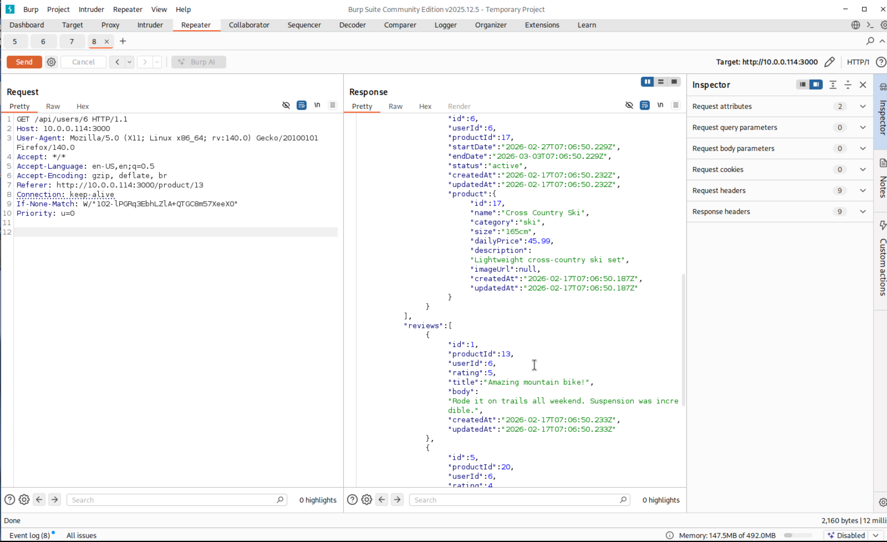

The request to retrieve another user's profile exposed not only identity data but also associated reservations and reviews. The response included rental dates, product identifiers, and activity history belonging to a different account. This demonstrates that the authorization mechanism fails to enforce object-level access control, allowing any authenticated user to view operational history tied to other customers. The impact extends beyond personal data exposure to behavioral and transaction intelligence leakage.

### Screenshot 10: Attempted Privilege Escalation via Role Manipulation

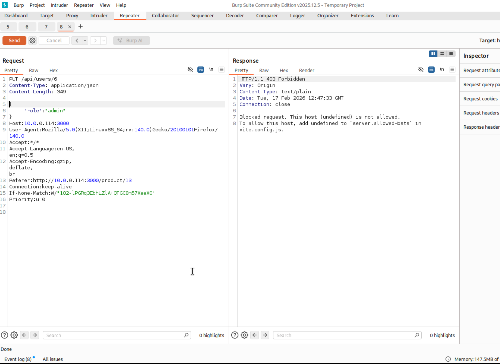

A direct PUT request was issued to /api/users/6 attempting to modify the account role to admin. The server rejected the request with a 403 Forbidden response, indicating host validation controls blocked the modification. Although the role change did not succeed, the test confirms that privilege escalation is reachable through client-side request manipulation. The endpoint accepts role attributes from user input, meaning proper authorization checks are relied upon to prevent elevation rather than input validation or separation of privilege logic.

### Screenshot 11: Direct Object Role Modification Attempt

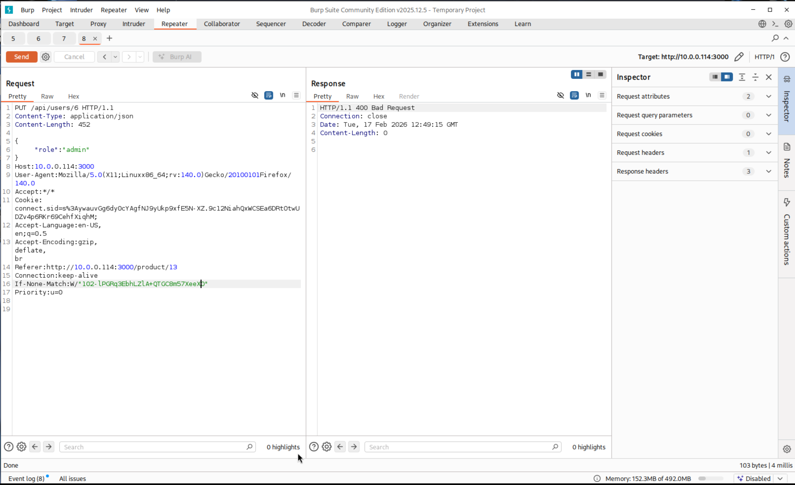

A crafted PUT request was sent to /api/users/6 with a JSON body containing "role":"admin" while authenticated as a normal user. The server returned a 400 Bad Request response. The request reached the endpoint and was processed but rejected due to validation or request formatting rather than authorization enforcement. This demonstrates the endpoint exposes role modification functionality to the client and relies on backend validation instead of strict access control separation, which represents a potential Broken Access Control risk if validation logic is bypassed or altered.

## Summary

Testing confirmed multiple authorization failures across the application. A normal user session successfully retrieved other users' profiles, reservation history, internal notes, password hashes, and administrative account information. Enumeration endpoints exposed the entire user database, including roles and email addresses. Sensitive system data such as backup credentials and keys were also disclosed through direct object access. Attempts to modify roles reached the endpoint, indicating the functionality was exposed to unprivileged users even when validation prevented completion.

The root cause is the absence of consistent server-side authorization checks and reliance on client trust and identifier values. Attackers could enumerate accounts, harvest credentials, escalate privileges, and access administrative information without authentication level changes. The application is vulnerable to account takeover, data breach, and full system compromise. Strong role verification, object ownership validation, and centralized authorization middleware are required to remediate the vulnerability.
